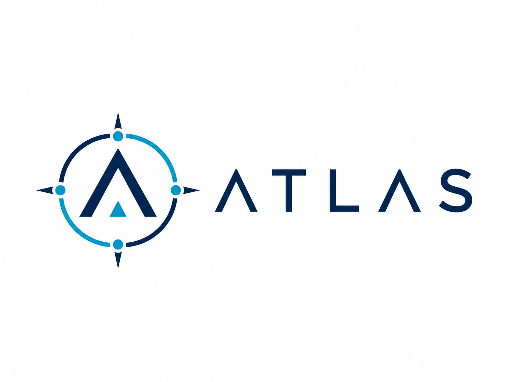
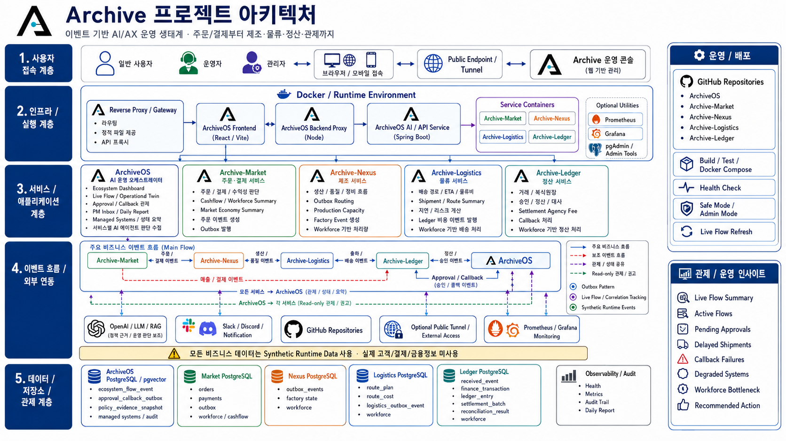

<p align="center">
  
</p>

# Atlas-Management

Atlas-Management는 여러 Atlas 서비스를 하나의 루트 포털에서 확인하고 진입하는 정적 운영 홈입니다.

## Service Role

Atlas-Management는 개별 Atlas 애플리케이션을 실행하거나 데이터를 처리하지 않습니다. 루트 경로 `/`에서 서비스 목록, 운영 상태, API 확인 경로를 제공하는 얇은 포털 역할만 수행합니다.

- Atlas 서비스군의 공통 진입점 제공
- 운영 중인 서비스와 접속 경로 표시
- 서비스별 목적과 역할 요약
- API 헬스 체크 경로 노출
- 신규 Atlas 서비스 추가를 위한 카드형 구조 유지
- `/travel/`, `/learn/`, `/health/`, `/jobs/`, `/api/` 경로와 책임 분리

## Core Flow

```text
User
  -> Atlas Management (/)
     -> Service Cards
        -> Travel Atlas   (/travel/)
        -> Learn Atlas    (/learn/)
        -> Health Atlas   (/health/)
        -> Incruit Atlas  (/jobs/)
     -> Operations Panel
        -> Atlas API      (/api/health)
        -> ArchiveOS-ready status model
```

| Target | Path | Role |
| --- | --- | --- |
| `Travel Atlas` | `/travel/` | 여행 일정, 장소, 좌표, 이동 경로를 지도 위에서 관리 |
| `Learn Atlas` | `/learn/` | 백엔드 지식, 면접, 설계 역량 학습 |
| `Health Atlas` | `/health/` | 건강, 운동, 수면 데이터 확인 |
| `Incruit Atlas` | `/jobs/` | 백엔드·AX 채용 공고 수집, 평가, 알림, 지원 상태 관리 |
| `Atlas API` | `/api/health` | API 상태 확인 |

## Platform Flow

```text
Nginx Root
  -> Atlas Management
     -> Static service entry
     -> Service status summary
     -> API health shortcut
     -> Future ArchiveOS event/status bridge

Service Routing
  -> /travel/  -> Route/Travel Atlas bundle
  -> /learn/   -> Backend/Learn Atlas bundle
  -> /health/  -> Health Atlas bundle
  -> /jobs/    -> Incruit Atlas bundle
  -> /api/     -> Atlas API proxy
```

| Layer | Responsibility | Notes |
| --- | --- | --- |
| `Nginx Root` | 루트 `/` 요청을 Atlas-Management로 제공 | 하위 서비스 alias와 분리 |
| `Atlas Management` | 서비스 카드, 운영 링크, 상태 요약 표시 | 정적 HTML/CSS |
| `Service Bundles` | 각 Atlas 앱의 실제 사용자 기능 제공 | `/travel/`, `/learn/`, `/health/`, `/jobs/` |
| `Atlas API` | 서버 상태와 서비스 API 제공 | `/api/` proxy |
| `ArchiveOS bridge` | 향후 상태/이벤트 관제 연동 | 현재는 구조만 준비 |

## Project Architecture

<p align="center">
  
</p>

## Repository Structure

```text
Atlas-Management/
├── docs/
│   └── architecture/
│       └── atlas-project-architecture.png
├── index.html
├── atlas-management.css
├── atlas-logo.png
├── atlas-mark.png
├── atlas-mark.svg
└── README.md
```

## Brand Assets

| Asset | Purpose |
| --- | --- |
| `atlas-logo.png` | GitHub README 상단 Atlas 원본 로고 |
| `docs/architecture/atlas-project-architecture.png` | Atlas 전체 프로젝트 구조 이미지 |
| `atlas-mark.svg` | 웹 헤더와 favicon용 Atlas 마크 |
| `atlas-mark.png` | Apple touch icon, 북마크 이미지 |

README 상단 로고는 Gmail `Atlas Logo` 제목의 원본 이미지와 동일한 `atlas-logo.png`를 사용합니다. 해시 기준으로 현재 저장소 이미지와 Gmail 첨부 로고가 동일함을 확인했습니다.

## Local Run

정적 사이트이므로 별도 빌드가 필요 없습니다.

```bash
cd /home/opc/Atlas-Management
python3 -m http.server 8080
```

| Target | URL |
| --- | --- |
| Local portal | `http://127.0.0.1:8080/` |

## Production Layout

운영 서버에서는 nginx 루트 `/`에만 배포합니다.

```text
/usr/share/nginx/html/
```

다음 경로는 Atlas-Management 배포 과정에서 삭제하거나 덮어쓰면 안 됩니다.

```text
/usr/share/nginx/html/travel
/usr/share/nginx/html/learn
/usr/share/nginx/html/health
/usr/share/nginx/html/jobs
```

`/api/` nginx proxy 설정도 Atlas-Management와 별개로 유지합니다.

## Smoke Test

```bash
curl -I http://127.0.0.1/
curl -I http://127.0.0.1/travel/
curl -I http://127.0.0.1/learn/
curl -I http://127.0.0.1/health/
curl -I http://127.0.0.1/jobs/
curl -I http://127.0.0.1/api/health
```

Expected behavior:

- `/`는 Atlas Management 포털을 반환합니다.
- `/travel/`, `/learn/`, `/health/`, `/jobs/`는 각 서비스 앱을 반환합니다.
- `/api/health`는 API 헬스 체크 응답을 반환합니다.
- 루트 포털 배포가 하위 서비스 디렉터리와 API proxy에 영향을 주지 않습니다.

## Operational Principles

- Atlas-Management는 루트 포털만 담당합니다.
- 하위 서비스의 빌드 산출물은 각 서비스 디렉터리에서 관리합니다.
- secret, API key, webhook, private key는 문서와 정적 파일에 포함하지 않습니다.
- 서비스 상태값은 실제 운영 점검 결과와 다르면 즉시 갱신합니다.
- 신규 서비스는 카드, quick link, smoke test 항목을 함께 추가합니다.

## Recommended Next Work

운영 포털로 더 안정적으로 쓰려면 다음 작업이 필요합니다.

1. `atlas-status.json` 기반 실제 서비스 상태 자동 표시
2. 마지막 배포 시간과 git commit SHA 표시
3. 서비스별 README 또는 운영 문서 링크 추가
4. `/api/health` 외 서비스별 health endpoint 정리
5. ArchiveOS 이벤트 연동
6. 서비스 목록을 `services.json`으로 분리
